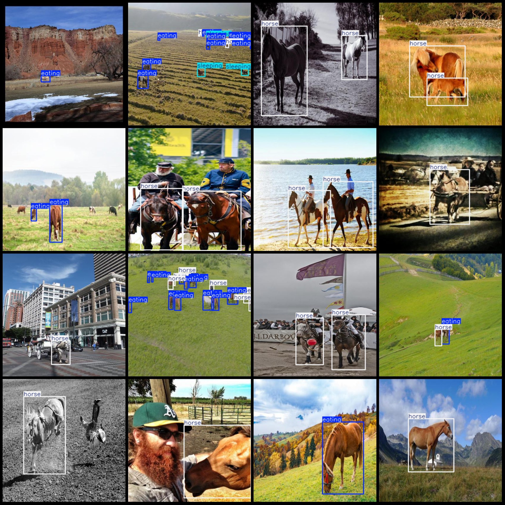
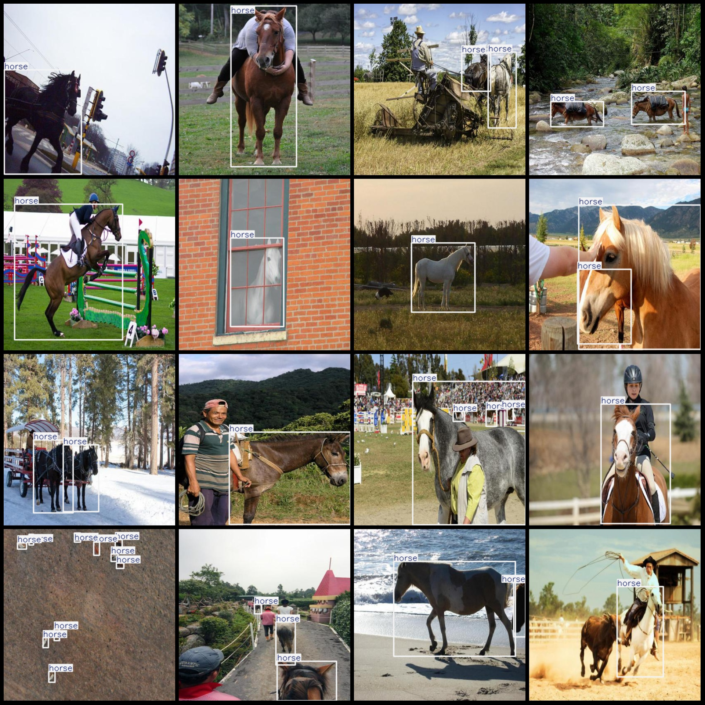

# Horse Behavior State Detection Dataset VOC+YOLO format, 3267 images in 3 categories

Dataset format: Pascal VOC format + YOLO format (without split path txt file, only contain jpg image and corresponding VOC format xml file and yolo format txt file)
number of images: 3267  
annotation count: 3267  
annotation count: 3267  
annotationnumber of classes: 3  
annotation class names: ["eating", "horse", "sleeping"]
boxes per class:   
Eating (in the process of eating) box count = 1756
Horse (in the process of horse) box count = 7327
Sleeping (in the process of sleeping) box count = 142
total boxes: 9225  
images per class:   
Eating images: 598
Horse images: 3013
Sleeping images: 71
image resolution: 416x416  
Annotation Tool: labelImg
Annotation Rules: Draw a rectangle around the class.
Important Notes: The dataset does not have a separate training, validation, and test set. You need to partition it yourself.
Special Statement: This dataset does not guarantee the accuracy of the trained model or weight files.
Image Preview:
## Images

Here is a pay link on Stripe ( https://buy.stripe.com/3cs8yP7sY87d0vu9AB ). Please contact me lonlonago@foxmail.com after funding $89, and I will send you a complete data files , thank you!

